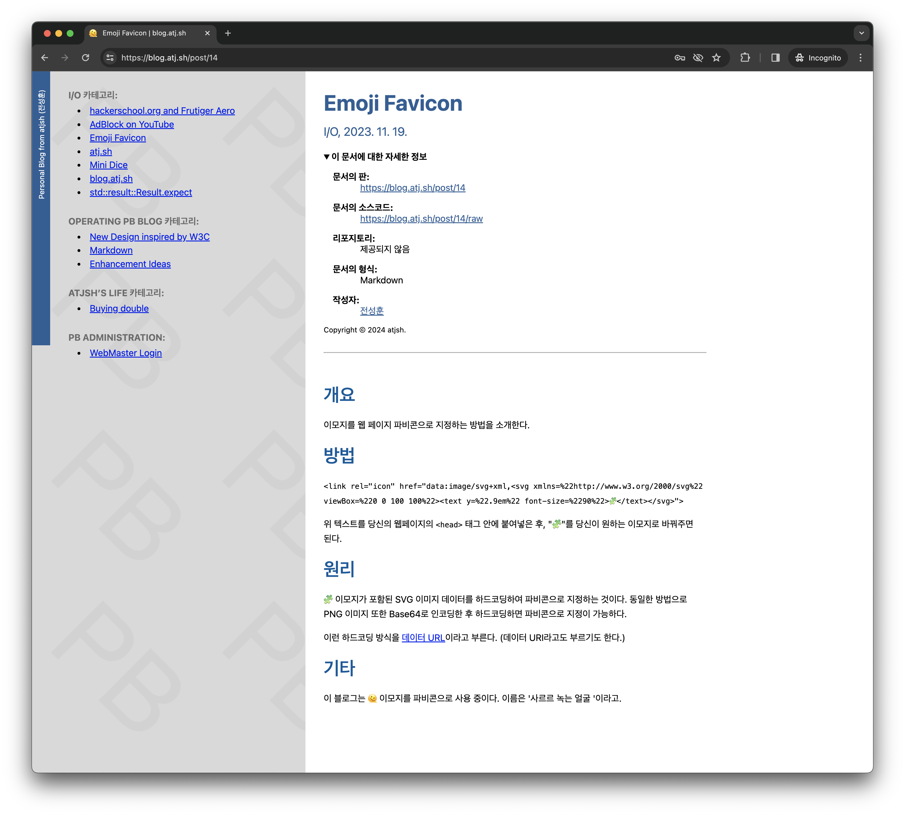

# Making a blog web app with SvelteKit and axum

[](https://blog.atj.sh)

see it in action: [blog.atj.sh](https://blog.atj.sh)

<hr>

  

<hr>

This is my side project.

It consists of two parts:
A [rust](https://www.rust-lang.org/) web server application written with [axum](https://github.com/tokio-rs/axum) that will be deployed to [AWS Lambda](https://aws.amazon.com/lambda/),
and a web client written with [SvelteKit](https://kit.svelte.dev/) and [typescript](https://www.typescriptlang.org/). It uses [PostgreSQL](https://www.postgresql.org/) as a database.

## server

I chose to use [axum](https://github.com/tokio-rs/axum) as a web framework, and [sqlx](https://github.com/launchbadge/sqlx) as a database driver. The app will deployed to [AWS Lambda](https://aws.amazon.com/lambda/) and locally tested with [cargo-lambda](https://github.com/cargo-lambda/cargo-lambda).

## web-client

I Chose to use [SvelteKit](https://kit.svelte.dev/) as a web framework, and [typescript](https://www.typescriptlang.org/) as a language. The app will be deployed to [Cloudflare Pages](https://pages.cloudflare.com/) and locally tested with [vite](https://vitejs.dev/).

## Develop locally

### server

```bash
cargo lambda watch -p 3000
```

and local [cargo-lambda](https://github.com/cargo-lambda/cargo-lambda) server will be running.

### web-client

```bash
npm i
npm run dev
```

and local vite server will be running.
